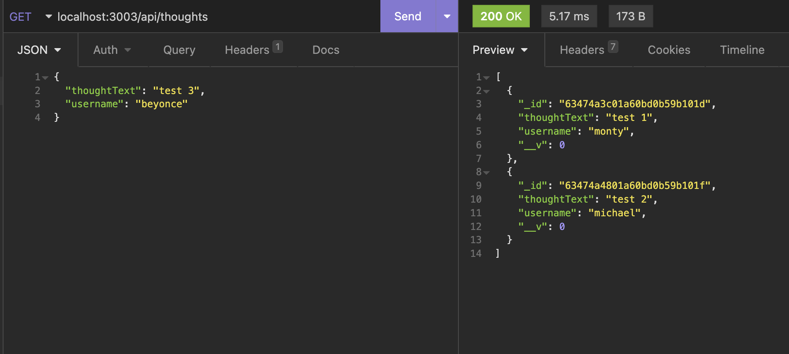

# socialNetworkAPI

This application that allows the user to get data, post new content, update current content and delete content in insomnia.
### Intallation:
to install the dependencies open the terminal and run:
npm i 
npm start
### Usage:
manipulate the routes in insomnia using the CRUD operations to receive/manipulate the data
### Contributors:
Keli-Rene Sparks

Tracy Guajardo
### screenshot:
examples of different GET routes

### Links
[github](https://github.com/mmontoya1112/ecommerce-backend)

[walk through](https://drive.google.com/file/d/1rRWMWWUZwEeTszfH9R9jCjZ1j71nLmBd/view)